# Immunis: The Self-Healing AI


---


## The Problem
Large Language Models (LLMs) are vulnerable to **Prompt Injection**—attacks where users manipulate system instructions to leak data or bypass safety filters. Traditional observability tools log these attacks, but often only alert administrators *after* the damage is done.

## The Solution
Immunis creates a **Bi-Directional Security Loop**:
1.  **Detect:** A lightweight "Guard Dog" model (Gemini Flash) scores every prompt before execution.
2.  **Stream:** Telemetry is pushed instantly to Datadog Logs.
3.  **React:** A Datadog Monitor detects high-risk scores and fires a Webhook.
4.  **Defend:** The Webhook triggers a "Lockdown Mode" in the application, blocking further interaction [1].

---

## Architecture



---

## Features

*   **Real-Time Threat Scoring:** Uses **Gemini 1.5 Flash** to analyze user intent in milliseconds [1].
*   **Active Defense:** Automatically patches the System Prompt to "Lockdown Mode" when under attack.
*   **Datadog Integration:** Full telemetry streaming including `attack_score`, `latency`, and `prompt_text`.
*   **Hacker-Style CLI:** A professional terminal interface built with the `Rich` library.
*   **Event-Driven:** Uses Webhooks to close the loop between Observability and Application Logic [1].

---

## Tech Stack

*   **Language:** Python 3.10+
*   **AI Models:** Google Vertex AI (Gemini 2.5 Pro & Flash)
*   **Observability:** Datadog (Logs Intake API & Monitors)
*   **Backend:** FastAPI (Webhook Listener)
*   **Deployment:** Google Cloud Run (Backend) & Local CLI (Client) [1].

---

## Getting Started

### Prerequisites
*   Python 3.10+ installed.
*   A **Google Cloud** Project with Vertex AI API enabled.
*   A **Datadog** Account (Free trial works).
*   (Optional) `ngrok` for local testing.

### 1. Clone the Repository
```bash
git clone https://github.com/yourusername/immunis.git
cd immunis
```

### 2. Install Dependencies
```bash
uv sync 

uv run immunis-cli
```

### 3. Configure Environment
Create a `.env` file in the root directory:
```ini
# Google Cloud
GOOGLE_API_KEY="your_google_ai_studio_key" 
# OR use Vertex AI credentials via 'gcloud auth application-default login'

# Datadog
DD_API_KEY="your_datadog_api_key"
DD_SITE="datadoghq.com" # or datadoghq.eu

```

---

## 🏆 Hackathon Context
Built for the **AI Partner Catalyst** (Devpost).
*   **Track:** Datadog (End-to-End Observability for LLMs).
*   **Challenge Met:** Implemented an innovative monitoring strategy with actionable items (webhooks) [1].
*   **Compliance:** Uses Google Cloud (Vertex AI) + Partner Tech (Datadog) exclusively [1].

---

